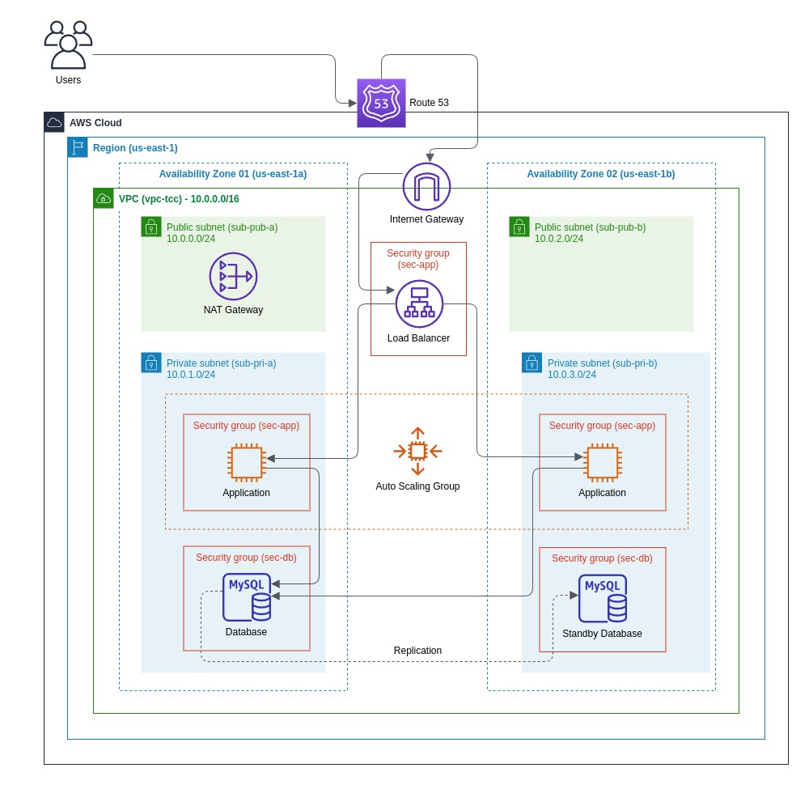

# Arquitetura AWS Resiliente e Escalável: Implementação e Avaliação de um Cenário Real

## Resumo 
Este trabalho apresenta o desenvolvimento e a avaliação de uma arquitetura em nuvem projetada para oferecer alta disponibilidade e capacidade de escalar de acordo com as demandas do sistema. O trabalho teve como objetivo principal construir uma solução robusta e eficiente, capaz de suportar picos de carga e garantir a continuidade dos serviços, mesmo em caso de falhas.